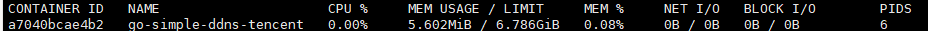

# go-simple-ddns-tencent

学习golang后的第一个程序，致力于用最简单直接的代码实现。
通过cloudflare接口获取当前网络环境IPv4、IPv6，并通过腾讯云SDK添加或更新DNS记录，实现腾讯云DDNS。

> [腾讯云接口](https://console.cloud.tencent.com/api/explorer?Product=dnspod&Version=2021-03-23&Action=CreateRecord&SignVersion=)
> [cloudflare获取IP接口](https://www.cloudflare.com/cdn-cgi/trace)，如果使用cloudflare warp，会导致地址错误

## 功能

- DNS服务商:
    - [x] 腾讯云、DNSPOD（需腾讯云密钥）

- 客户端平台:
    - [x] Windows
    - [x] Linux
    - [x] macOS

- IP协议栈:
    - [x] IPv4
    - [x] IPv6

- 其他:
    - [x] Golang强制使用IPv4
    - [x] 自动添加、删除、更新IPv4与IPv6
    - [x] 首先解析当前地址判断是否需要更新，防止无效更新API
    - [x] 源码运行
    - [x] github打tag后自动通过Action生成二进制，推送到release
    - [x] 启动后定时每10分钟运行一次
    - [ ] TTL设置
    - [x] 日志
    - [ ] 设置系统服务
    - [x] Docker
    - [ ] 通知（邮箱、PushDeer）

# Quick start

- 源码运行
  - git clone https://github.com/Qetesh/go-simple-ddns-tencent
  - 复制`config.sample.ini`为`config.ini`，根据注释修改相应参数
  - go mod tidy && go run go-simple-ddns-tencent.go
- 二进制运行
  - 根据平台下载releases对应二进制，配置配置文件或环境变量运行
- 容器运行
> 使用Dockerfile生成镜像，并指定环境变量运行，默认架构为amd64，通过Dockerfile指定架构运行。
> 
> 由于默认docker不支持IPv6，所以需要使用host模式。
>
> 资源占用如下图，大约5MB内存左右，定时600秒检测更新一次。
> 
  - 运行格式：`docker build -t go-simple-ddns-tencent . && docker run --env secretid=<secretid> --env secretkey=<secretkey> --env configDomain=<域名> --env configSubdomain=<子域名> --env enableIPv6=<true 或 false> --name go-simple-ddns-tencent --net host go-simple-ddns-tencent`    
  - 举例：`docker build -t go-simple-ddns-tencent . && docker run --env secretid=AKID****** --env secretkey=***** --env configDomain=domain.com --env configSubdomain=www --env enableIPv6=true --name go-simple-ddns-tencent --net host go-simple-ddns-tencent`